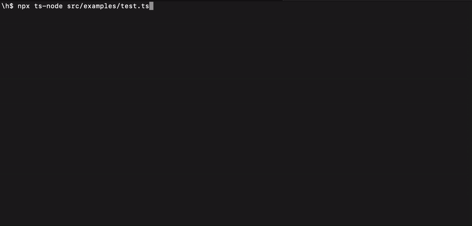

# node-js-console-selector

NodeJS Console Selector is an efficient and easy-to-use library for creating interactive console applications. With this library, you can offer users a selection of options directly from the command line.

## Features

- **Simple API**: Easy to integrate and use.
- **Customizable Prompts**: Tailor prompts to fit your application's needs.
- **Key Navigation**: Users can navigate options using keyboard keys.
- **Async/Await Support**: Works seamlessly with modern JavaScript syntax.
- **TS Support**: Fully compatible with TypeScript

## Installation

Install via npm:

```sh
npm install nodejs-console-selector
```

## Usage

Here’s a quick example to get you started with `nodejs-console-selector`:

```typescript
import { list } from 'nodejs-console-selector';

(async () => {
    const choices = ['Option 1', 'Option 2', 'Option 3'];
    const selected = await list({
        message: 'Please select an option:',
        options: choices,
    });
    
    console.log(`You selected: ${selected}`);
    process.exit();
})();
```
Then type in your terminal

```sh
npx run ts-node path/to/your/file.ts
```

And how it works

